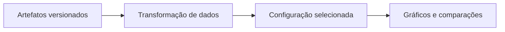

<div align="center">


# DeepSWE View

### Resultados, custo e configuração em perspectiva.

Interface para explorar os artefatos de leaderboard DeepSWE, suas versões e configurações de modelos, com gráficos e controles de apresentação.

[](package.json)

[Começar](#comece-aqui) · [Recursos](#o-que-você-encontra) · [Arquitetura](#como-o-projeto-se-organiza) · [Documentação](#documentação)

</div>

## Do objetivo ao resultado

| Selecione | Explore | Contextualize |
| --- | --- | --- |
| Versão do artefato e configuração de modelo. | Curvas, escala e pontos de resultado. | Interprete custo e desempenho conforme o recorte escolhido. |



## O que você encontra

- Artefatos separados para versões v1 e v1.1.
- Comparações e gráficos alimentados por dados versionados.
- Tema persistente no navegador e verificações específicas de dados e interação.

## Comece aqui

Os comandos partem da raiz de um clone deste repositório, salvo quando incluem o próprio clone.

```sh
npm ci
npm run dev
```

Use Node compatível com Vite 7 (20.19+ ou 22.12+). O script dev escuta em 0.0.0.0: a interface pode ficar acessível na sua rede. Abra a URL indicada pelo Vite.

## Como o projeto se organiza

| Caminho | Responsabilidade |
| --- | --- |
| [src/main.js](src/main.js) | Interface e interações. |
| [src/leaderboard-data.js](src/leaderboard-data.js) | Seleção e transformação dos artefatos. |
| [artifacts/v1/](artifacts/v1/) | Dados da primeira versão. |
| [artifacts/v1.1/](artifacts/v1.1/) | Dados da versão seguinte. |
| [scripts/](scripts/) | Verificações de gráficos, dados e menus. |

## Configuração e dados

O frontend importa os JSONs do repositório no build. O nome leaderboard-live.json não significa atualização contínua durante a visita. Atualizações de dados exigem revisar o artefato e suas transformações, incluindo configurações padrão e preços presentes no código.

## Verificação

```sh
npm run test:data
npm run test:chart-hover-label
npm run test:chart-path
npm run test:chart-scale
npm run test:menu
npm run test:config-toggle
npm run build
```

Os comandos acima são os pontos de verificação do projeto, não uma declaração de execução nesta revisão documental. Consulte os requisitos de cada ferramenta antes de rodá-los.

## Limitações e cuidados

Este repositório apresenta resultados; não é o executor do benchmark. Não interprete modelos, preços ou resultados versionados como valores atuais verificados. Comparações dependem do conjunto de tarefas, versão e esforço selecionados; preserve fonte e metodologia de cada artefato.

## Documentação

- [Guia de manutenção e operação](docs/PROJECT_GUIDE.md)

O banner é uma ilustração original de identidade criada com IA. Objetos, telas e valores ilustrados não são capturas da aplicação, resultados medidos nem marcas oficiais de terceiros.
